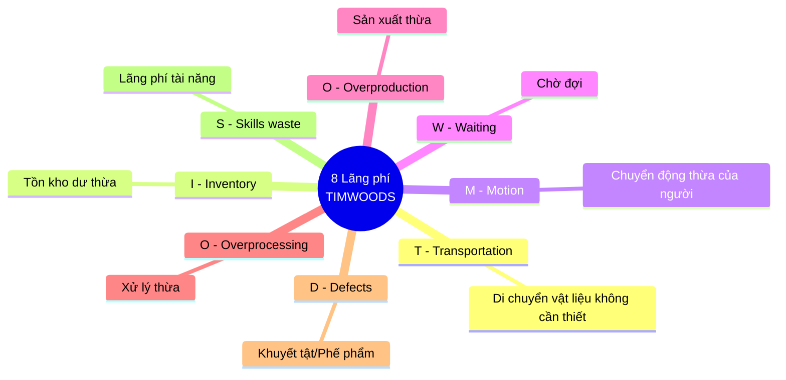
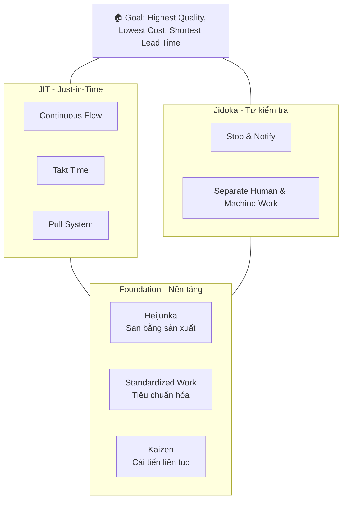
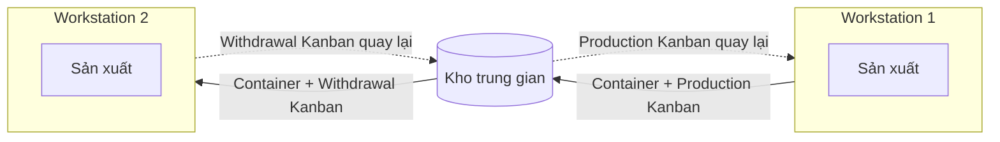

# Chapter 4 - Lean Systems

## Tổng quan (Overview)

Chương 4 giới thiệu về [[Lean Systems]] (Hệ thống tinh gọn) - một triết lý vận hành tập trung vào việc LOẠI BỎ LÃNG PHÍ và TỐI ĐA HÓA GIÁ TRỊ cho khách hàng. Lean bắt nguồn từ [[Toyota Production System]] (TPS) - hệ thống sản xuất của Toyota được phát triển từ những năm 1950 bởi [[Taiichi Ohno]] và [[Shigeo Shingo]].

Triết lý Lean không chỉ áp dụng cho sản xuất mà còn cho dịch vụ, y tế, phần mềm, và mọi lĩnh vực. Ý tưởng cốt lõi đơn giản nhưng mạnh mẽ: mọi hoạt động không tạo ra giá trị cho khách hàng đều là lãng phí ([[Muda]]) và cần được loại bỏ.

Chương trình bày các công cụ quan trọng của Lean: [[Kanban System]], [[Value Stream Mapping]], [[JIT|Just-in-Time]], và các phương pháp bố trí nhà máy tinh gọn. Đây là một trong những chương quan trọng nhất vì Lean là nền tảng của nhiều phương pháp quản lý hiện đại.

---

## Continuous Improvement & Lean Philosophy (Cải tiến liên tục & Triết lý Lean)

### Định nghĩa (Definition)
[[Lean Philosophy]] là tư duy loại bỏ mọi lãng phí trong quy trình để chỉ còn lại các hoạt động tạo giá trị cho khách hàng. [[Continuous Improvement]] ([[Kaizen]]) là quá trình cải tiến không ngừng, từng bước nhỏ, mỗi ngày tốt hơn hôm qua.

### Giải thích chi tiết

#### 8 loại lãng phí ([[Muda]]) - TIMWOODS:
1. **T - [[Transportation Waste]]** (Vận chuyển): Di chuyển vật liệu/sản phẩm không cần thiết
2. **I - [[Inventory Waste]]** (Tồn kho): Tồn kho quá mức cần thiết → đóng băng vốn
3. **M - [[Motion Waste]]** (Chuyển động): Chuyển động không cần thiết của người/máy
4. **W - [[Waiting Waste]]** (Chờ đợi): Thời gian chờ giữa các bước xử lý
5. **O - [[Overproduction Waste]]** (Sản xuất thừa): Sản xuất nhiều hơn nhu cầu → **lãng phí tệ nhất** vì tạo ra các lãng phí khác
6. **O - [[Overprocessing Waste]]** (Xử lý thừa): Làm nhiều hơn mức khách hàng yêu cầu
7. **D - [[Defect Waste]]** (Sai lỗi): Sản phẩm lỗi phải sửa hoặc bỏ
8. **S - [[Skills Waste]]** (Lãng phí tài năng): Không tận dụng kỹ năng/ý tưởng của nhân viên

> **Sơ đồ 8 loại lãng phí (TIMWOODS):**



#### Nguyên tắc Lean (5 Lean Principles):
1. **[[Value]]**: Xác định giá trị từ góc nhìn khách hàng
2. **[[Value Stream]]**: Nhận diện toàn bộ dòng giá trị
3. **[[Flow]]**: Tạo dòng chảy liên tục, không gián đoạn
4. **[[Pull System]]**: Sản xuất theo nhu cầu thực tế (kéo), không đẩy
5. **[[Perfection]]**: Hướng tới hoàn hảo, cải tiến không ngừng

### Ví dụ thực tế
Bệnh viện áp dụng Lean: Giảm thời gian chờ khám từ 3 giờ xuống 30 phút bằng cách loại bỏ các bước thủ tục không cần thiết (overprocessing), sắp xếp lại khu vực khám (motion waste), và giảm giấy tờ trùng lặp.

### Liên kết
- [[Toyota Production System]]
- [[Kaizen]]
- [[Muda]]
- [[CH03 - Quality and Performance]]
- [[Continuous Improvement]]

---

## Strategic Characteristics of Lean Systems (Đặc điểm chiến lược của hệ thống Lean)

### Giải thích chi tiết

> 
> *Figure 4.2: Cấu trúc hệ thống Lean*

Các đặc điểm chiến lược:

1. **[[Pull System]]** (Hệ thống kéo) vs [[Push System]] (Hệ thống đẩy)
   - **Push**: Sản xuất dựa trên DỰ BÁO → dễ tạo tồn kho thừa
   - **Pull**: Sản xuất khi có NHU CẦU THỰC TẾ → giảm tồn kho
   - Ví dụ Pull: Quán sushi băng chuyền chỉ làm thêm khi đĩa trên băng chuyền giảm

2. **[[Small Lot Sizes]]** (Kích thước lô nhỏ)
   - Sản xuất lô nhỏ → ít tồn kho, phát hiện lỗi nhanh
   - Đòi hỏi [[Setup Time]] ngắn → sử dụng [[SMED]] (Single-Minute Exchange of Die)

3. **[[Uniform Workstation Loads]]** (Tải trọng đồng đều)
   - [[Heijunka]] (cân bằng sản xuất): Phân bổ sản lượng đều đặn
   - Tránh cao điểm/thấp điểm → ổn định hơn

4. **[[Standardized Components and Methods]]** (Linh kiện và phương pháp chuẩn hóa)
   - Sử dụng linh kiện chung cho nhiều sản phẩm
   - [[Standard Work]]: Quy trình chuẩn cho mọi nhiệm vụ

5. **[[Close Supplier Ties]]** (Quan hệ gần gũi với nhà cung cấp)
   - Ít nhà cung cấp, quan hệ dài hạn, tin tưởng
   - Giao hàng thường xuyên, lô nhỏ, đúng lúc

6. **[[Flexible Workforce]]** (Lao động linh hoạt)
   - [[Cross-Training]]: Công nhân biết làm nhiều việc
   - Có thể điều chuyển linh hoạt theo nhu cầu

7. **[[Jidoka]]** (Tự động hóa thông minh / Automation with a human touch)
   - Máy tự dừng khi phát hiện lỗi
   - Công nhân có quyền kéo dây [[Andon]] dừng dây chuyền
   - Ngăn lỗi lan truyền

8. **[[5S]]** - Phương pháp tổ chức nơi làm việc:
   - **Seiri** (Sàng lọc / Sort): Loại bỏ đồ không cần
   - **Seiton** (Sắp xếp / Set in Order): Mỗi thứ có chỗ riêng
   - **Seiso** (Sạch sẽ / Shine): Vệ sinh nơi làm việc
   - **Seiketsu** (Chuẩn hóa / Standardize): Duy trì 3S trên
   - **Shitsuke** (Duy trì / Sustain): Tạo thói quen, kỷ luật

### Liên kết
- [[Pull System]]
- [[Heijunka]]
- [[SMED]]
- [[Jidoka]]
- [[5S]]
- [[Andon]]

---

## Toyota Production System (TPS)

### Định nghĩa (Definition)
[[Toyota Production System]] (TPS) là hệ thống quản lý sản xuất của Toyota, được coi là nguồn gốc của [[Lean Manufacturing]]. TPS thường được mô tả bằng hình ảnh "Ngôi nhà TPS" ([[TPS House]]).

### Giải thích chi tiết

> 
> *Figure 4.4: TPS House - 2 trụ cột JIT + Jidoka trên nền tảng Heijunka & Kaizen*

**Ngôi nhà TPS:**

```
          ┌─────────────────────────┐
          │  Chất lượng cao nhất     │
          │  Chi phí thấp nhất       │  ← MÁI NHÀ (Mục tiêu)
          │  Thời gian ngắn nhất     │
          └─────────┬───────────────┘
     ┌──────────────┴──────────────┐
     │                             │
┌────┴────┐                 ┌──────┴──────┐
│  JIT    │                 │   Jidoka    │  ← HAI CỘT TRỤ
│         │                 │             │
│ Đúng lúc│                 │ Chất lượng  │
│ Đúng số │                 │ tại nguồn   │
│ lượng   │                 │             │
└────┬────┘                 └──────┬──────┘
     │                             │
     └──────────────┬──────────────┘
          ┌─────────┴───────────────┐
          │  Heijunka + Kaizen +    │  ← NỀN MÓNG
          │  Standardized Work + 5S │
          └─────────────────────────┘
```

> **Sơ đồ Ngôi nhà TPS (Toyota Production System House):**



**Hai cột trụ:**
1. **[[JIT]]** ([[Just-in-Time]]): Sản xuất đúng sản phẩm, đúng số lượng, đúng thời điểm
2. **[[Jidoka]]**: Xây dựng chất lượng vào quy trình, không phải kiểm tra sau

**Nền móng:**
- [[Heijunka]]: Cân bằng sản xuất
- [[Kaizen]]: Cải tiến liên tục
- [[Standard Work]]: Công việc chuẩn hóa
- [[5S]]: Tổ chức nơi làm việc

### Ví dụ thực tế
Toyota nổi tiếng với hệ thống dừng dây chuyền: bất kỳ công nhân nào phát hiện vấn đề đều có thể kéo dây Andon để dừng toàn bộ dây chuyền. Ban đầu, mọi người nghĩ điều này lãng phí thời gian. Nhưng thực tế, nó ngăn chặn lỗi lan truyền và buộc mọi người phải giải quyết vấn đề tại gốc → tiết kiệm nhiều hơn về lâu dài.

### Liên kết
- [[Lean Manufacturing]]
- [[JIT]]
- [[Jidoka]]
- [[Kaizen]]
- [[Taiichi Ohno]]

---

## Lean System Layouts (Bố trí nhà máy tinh gọn)

### One Worker Multiple Machines (Một công nhân nhiều máy - OWMM)

#### Định nghĩa (Definition)
[[One Worker Multiple Machines]] (OWMM) là cách bố trí trong đó một công nhân vận hành nhiều máy khác nhau, di chuyển giữa các máy theo chu kỳ.

#### Giải thích chi tiết
- Thay vì 1 người đứng 1 máy (lãng phí thời gian chờ máy chạy)
- 1 người đứng 3-5 máy: nạp nguyên liệu máy A → chờ máy A chạy → sang máy B nạp nguyên liệu → sang máy C lấy sản phẩm...
- Máy tự dừng khi hoàn thành ([[Jidoka]])
- Giảm nhân công, tăng [[Utilization]]

### Group Technology (Công nghệ nhóm)

#### Định nghĩa (Definition)
[[Group Technology]] (GT) là phương pháp nhóm các sản phẩm có quy trình sản xuất tương tự vào cùng một [[Manufacturing Cell]] (ô sản xuất).

#### Giải thích chi tiết
- **[[Manufacturing Cell]]** (Ô sản xuất): Nhóm các máy khác nhau được xếp gần nhau để sản xuất một nhóm sản phẩm tương tự ([[Part Family]])
- Thường bố trí hình chữ U ([[U-Shaped Layout]]) để:
  - Công nhân dễ di chuyển giữa các máy
  - Dễ cân bằng tải công việc
  - Tiết kiệm không gian
  - Cải thiện giao tiếp giữa các công nhân

**So sánh:**

| Đặc điểm | Bố trí truyền thống (Functional Layout) | [[Manufacturing Cell]] |
|-----------|----------------------------------------|----------------------|
| Sắp xếp | Theo loại máy (tất cả máy tiện 1 khu) | Theo sản phẩm |
| Khoảng cách | Xa, nhiều vận chuyển | Gần, ít vận chuyển |
| Tồn kho WIP | Cao | Thấp |
| Thời gian sản xuất | Dài | Ngắn |
| Giao tiếp | Khó | Dễ |

### Ví dụ thực tế
Xưởng cơ khí truyền thống: tất cả máy tiện ở khu A, máy phay ở khu B, máy khoan ở khu C → sản phẩm phải di chuyển nhiều. Sau khi áp dụng GT: tạo 3 ô sản xuất, mỗi ô có máy tiện + phay + khoan, chuyên sản xuất một nhóm sản phẩm → giảm 80% khoảng cách vận chuyển.

### Liên kết
- [[U-Shaped Layout]]
- [[Part Family]]
- [[Cellular Manufacturing]]
- [[Jidoka]]

---

## Kanban System (Hệ thống Kanban)

### Định nghĩa (Definition)
[[Kanban System]] là hệ thống kiểm soát sản xuất và tồn kho sử dụng tín hiệu (thẻ, container, tín hiệu điện tử) để kích hoạt sản xuất hoặc di chuyển vật liệu. "Kanban" tiếng Nhật nghĩa là "bảng hiệu" hoặc "thẻ tín hiệu".

### Giải thích chi tiết

> 
> *Figure 4.5: Kanban cards điều khiển dòng sản xuất*

> 
> *Figure 4.6: Production Kanban và Withdrawal Kanban luân chuyển giữa workstations*

#### Các quy tắc Kanban:
1. Mỗi container phải có thẻ Kanban
2. Trạm sau (downstream) "kéo" sản phẩm từ trạm trước (upstream)
3. Trạm trước chỉ sản xuất khi nhận được Kanban
4. Không gửi sản phẩm lỗi sang trạm sau
5. Số lượng Kanban phải được giảm dần theo thời gian (để lộ vấn đề và cải tiến)

#### Hai loại Kanban chính:
- **[[Production Kanban]]** (Kanban sản xuất): Báo hiệu trạm sản xuất cần sản xuất thêm
- **[[Withdrawal Kanban]]** (Kanban rút hàng): Báo hiệu cần di chuyển vật liệu đến trạm tiếp theo

> **Sơ đồ dòng chảy Kanban (Kanban Flow):**



#### Công thức tính số container Kanban:

$$k = \frac{d(w + p)(1 + c)}{n}$$

Trong đó:
- $k$ = Số container (thẻ Kanban) cần thiết
- $d$ = [[Demand Rate]] (nhu cầu trung bình mỗi kỳ)
- $w$ = [[Waiting Time]] (thời gian chờ trung bình của container)
- $p$ = [[Processing Time]] (thời gian xử lý trung bình)
- $c$ = Hệ số an toàn ([[Safety Factor]]) - biến số chính sách, càng gần 0 càng Lean
- $n$ = Số đơn vị trong mỗi container

### Ví dụ thực tế
Nhà máy lắp ráp xe máy:
- Nhu cầu bu lông: d = 300 bộ/giờ
- Thời gian chờ: w = 0.02 giờ
- Thời gian xử lý: p = 0.05 giờ
- Hệ số an toàn: c = 0.10
- Mỗi container chứa: n = 25 bộ

$$k = \frac{300(0.02 + 0.05)(1 + 0.10)}{25} = \frac{300(0.07)(1.1)}{25} = \frac{23.1}{25} = 0.924 \approx 1 \text{ container}$$

Cần ít nhất 1 container Kanban. Trong thực tế thường làm tròn lên.

### Liên kết
- [[Pull System]]
- [[JIT]]
- [[Toyota Production System]]
- [[Inventory Management]]
- [[WIP]] (Work-in-Process)

---

## Value Stream Mapping (Sơ đồ dòng giá trị)

### Định nghĩa (Definition)
[[Value Stream Mapping]] (VSM) là công cụ trực quan hóa toàn bộ dòng chảy vật liệu và thông tin từ nguyên liệu đến sản phẩm cuối cùng, giúp nhận diện lãng phí và cơ hội cải tiến.

### Giải thích chi tiết

> 
> *Figure 4.7: Value Stream Map - Bản đồ hiện trạng (Current State Map)*

#### Current State Map (Bản đồ trạng thái hiện tại)
[[Current State Map]] mô tả quy trình HIỆN TẠI:
- Tất cả các bước xử lý
- Dòng chảy vật liệu (Material Flow)
- Dòng chảy thông tin (Information Flow)
- Thời gian mỗi bước: [[Processing Time]], [[Lead Time]], [[Cycle Time]]
- Tồn kho giữa các bước ([[WIP]])
- Các chỉ số: [[Takt Time]], số ca, thời gian uptime

**Ký hiệu quan trọng:**
- Hộp quy trình: Bước xử lý
- Tam giác: Tồn kho
- Mũi tên đẩy: Push flow
- Mũi tên kéo: Pull flow (supermarket)
- Đường timeline ở dưới: Phân biệt thời gian tạo giá trị vs không tạo giá trị

> 
> *Figure 4.8: Value Stream Map - Bản đồ tương lai (Future State Map)*

#### Future State Map (Bản đồ trạng thái tương lai)
[[Future State Map]] mô tả quy trình SAU KHI cải tiến:
- Loại bỏ các bước không tạo giá trị
- Chuyển từ Push sang Pull
- Tạo dòng chảy liên tục ([[Continuous Flow]])
- Giảm tồn kho bằng [[Supermarket Pull System]]
- Sản xuất theo [[Takt Time]]

**[[Takt Time]]** (Nhịp sản xuất):
$$\text{Takt Time} = \frac{\text{Available Production Time per Day}}{\text{Customer Demand per Day}}$$

Ví dụ: Ngày làm việc 8 giờ = 480 phút, nhu cầu 240 sản phẩm/ngày → Takt Time = 480/240 = 2 phút/sản phẩm. Mỗi 2 phút phải hoàn thành 1 sản phẩm.

#### Các bước thực hiện VSM:
1. Chọn dòng sản phẩm (Product Family)
2. Vẽ Current State Map (đi thực tế quan sát - [[Gemba Walk]])
3. Xác định lãng phí và cơ hội cải tiến
4. Vẽ Future State Map
5. Lập kế hoạch hành động và triển khai

### Ví dụ thực tế
Nhà máy sản xuất đồ gỗ vẽ VSM và phát hiện:
- Lead time tổng: 30 ngày, nhưng thời gian xử lý thực tế chỉ 2 ngày
- 28 ngày còn lại là chờ đợi và tồn kho giữa các bước!
- Tỷ lệ giá trị gia tăng: 2/30 = 6.7% (rất thấp, điển hình cho nhiều ngành)
- Sau cải tiến: Lead time giảm xuống 8 ngày, tỷ lệ tăng lên 25%

### Liên kết
- [[Lean Systems]]
- [[Takt Time]]
- [[Continuous Flow]]
- [[Pull System]]
- [[Gemba Walk]]

---

## JIT - Just-in-Time (Đúng lúc)

### Định nghĩa (Definition)
[[JIT]] (Just-in-Time) là triết lý sản xuất và quản lý tồn kho trong đó vật liệu và sản phẩm được sản xuất và giao ĐÚNG số lượng cần, ĐÚNG thời điểm cần, không sớm hơn và không trễ hơn.

### Giải thích chi tiết

**Nguyên tắc JIT:**
- [[Zero Inventory]] (Tồn kho bằng 0): Mục tiêu lý tưởng - giảm tồn kho xuống mức thấp nhất
- [[Small Lot Production]]: Sản xuất lô nhỏ, chuyển đổi nhanh
- [[Quick Setup]] ([[SMED]]): Giảm thời gian chuyển đổi máy
- [[Uniform Plant Loading]] ([[Heijunka]]): San bằng sản xuất

**Ẩn dụ "Mực nước và đá ngầm":**
- Mực nước = Mức tồn kho
- Đá ngầm = Vấn đề (máy hỏng, chất lượng kém, nhà cung cấp chậm...)
- Tồn kho cao che giấu vấn đề (nước cao → không thấy đá)
- Giảm tồn kho → lộ ra vấn đề → buộc phải giải quyết → quy trình tốt hơn

**JIT trong dịch vụ:**
- Bệnh viện: Thuốc và vật tư y tế giao hàng ngày thay vì tồn kho lớn
- Nhà hàng: Nguyên liệu tươi giao mỗi sáng
- Bán lẻ: [[Cross-Docking]] - hàng từ xe tải nhà cung cấp chuyển thẳng lên xe tải giao hàng mà không qua kho

### Ví dụ thực tế
Toyota chỉ giữ tồn kho khoảng 2-4 giờ sản xuất. Khi trận động đất Tohoku 2011 xảy ra, Toyota bị ảnh hưởng nặng vì không có tồn kho dự trữ. Bài học: JIT hiệu quả nhưng cần [[Risk Management]] tốt và [[Supply Chain Resilience]].

Dell Computer: Khách đặt hàng → Dell mới đặt linh kiện từ nhà cung cấp → Lắp ráp trong vài giờ → Giao hàng. Tồn kho gần như bằng 0.

### Liên kết
- [[Kanban System]]
- [[Pull System]]
- [[Toyota Production System]]
- [[SMED]]
- [[Heijunka]]
- [[Inventory Management]]

---

## Công thức quan trọng (Key Formulas)

| Chỉ số | Công thức | Ý nghĩa |
|--------|-----------|---------|
| [[Takt Time]] | $\frac{\text{Available Time}}{\text{Demand}}$ | Nhịp sản xuất theo nhu cầu |
| Số container [[Kanban]] | $k = \frac{d(w+p)(1+c)}{n}$ | Số container Kanban cần thiết |
| Tỷ lệ giá trị gia tăng | $\frac{\text{Value-Added Time}}{\text{Total Lead Time}} \times 100\%$ | Hiệu quả dòng giá trị |
| [[SMED]] target | Setup time < 10 phút | Mục tiêu chuyển đổi nhanh |

---

## Từ khóa chính (Key Terms)

- [[Lean Systems]] - Hệ thống tinh gọn
- [[Lean Philosophy]] - Triết lý tinh gọn
- [[Toyota Production System]] - Hệ thống sản xuất Toyota
- [[Muda]] - Lãng phí
- [[Kaizen]] - Cải tiến liên tục
- [[JIT]] / [[Just-in-Time]] - Đúng lúc
- [[Kanban System]] - Hệ thống Kanban
- [[Pull System]] - Hệ thống kéo
- [[Push System]] - Hệ thống đẩy
- [[Value Stream Mapping]] - Sơ đồ dòng giá trị
- [[Current State Map]] - Bản đồ hiện tại
- [[Future State Map]] - Bản đồ tương lai
- [[Takt Time]] - Nhịp sản xuất
- [[Jidoka]] - Tự động hóa thông minh
- [[Andon]] - Hệ thống báo hiệu
- [[5S]] - Phương pháp tổ chức nơi làm việc
- [[Heijunka]] - Cân bằng sản xuất
- [[SMED]] - Chuyển đổi nhanh
- [[Poka-Yoke]] - Chống sai lỗi
- [[Group Technology]] - Công nghệ nhóm
- [[Manufacturing Cell]] - Ô sản xuất
- [[One Worker Multiple Machines]] - Một người nhiều máy
- [[Gemba Walk]] - Đi thực tế quan sát
- [[Standard Work]] - Công việc chuẩn hóa
- [[Continuous Flow]] - Dòng chảy liên tục
- [[Cross-Training]] - Đào tạo đa kỹ năng

---

> **Ghi chú ôn tập**: Lean/TPS là chương TRỌNG TÂM. Hãy nhớ: 8 loại lãng phí (TIMWOODS), 5 nguyên tắc Lean, công thức Kanban, và Takt Time. Lean kết nối chặt với [[CH03 - Quality and Performance]] (chất lượng tại nguồn) và [[CH06 - Constraint Management]] (quản lý nút thắt cổ chai).
